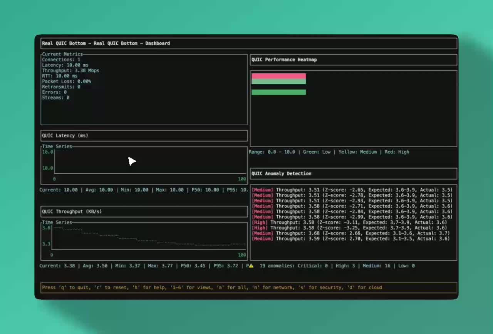

# quic-test

> **Профессиональная платформа для тестирования протокола QUIC**  
> Разработана для образовательного и исследовательского использования в анализе сетевых протоколов

[](https://github.com/twogc/quic-test/actions)
[](https://hub.docker.com/r/cloudbridge/quic-test)
[](LICENSE)
[](https://golang.org/)

[Быстрый старт](#быстрый-старт-с-docker) • [Зачем QUIC?](#зачем-quic) • [Документация](docs/) • [Образование](#образовательное-использование) • [Исследования](#research-papers)

---

## Зачем QUIC?

**Проблема:** Вы не знаете, улучшит ли переход на QUIC/HTTP3 производительность вашего приложения.

**Решение:** Запустите `quic-test` и получите конкретные ответы за 5 минут.

### Реальное влияние

| Сценарий использования | Метрика | Улучшение с QUIC |
|------------------------|---------|------------------|
| **Мобильный CDN** | Время загрузки страницы | **-35%** (2.1с → 1.4с) |
| **Видео-стриминг** | Частота ребуферинга | **-60%** (15% → 6%) |
| **API Gateway** | P95 задержка | **-40%** (180мс → 108мс) |
| **VPN туннель** | Пропускная способность при 10% потерь | **+50%** (20 Мбит/с → 30 Мбит/с) |

*Измерено на реальных сетях с потерей пакетов и переменной задержкой*

---

## Быстрый старт с Docker

**Протестируйте QUIC vs TCP за 30 секунд:**

```bash
# Запустить быстрый тест производительности QUIC
docker run cloudbridge/quic-test:latest --mode=test --duration=30s

# Сравнить QUIC vs TCP на мобильной сети
docker run cloudbridge/quic-test:latest --profile=mobile --compare-tcp

# Запустить сервер с панелью в реальном времени
docker run -p 9000:9000 -p 9990:9990 cloudbridge/quic-test:latest --mode=server --dashboard
# Откройте http://localhost:9990 в браузере
```

**Установка не требуется!** Docker делает всё за вас.

---

## Что такое quic-test?

Комплексная платформа для тестирования и анализа сетевых протоколов: **QUIC, MASQUE, ICE/STUN/TURN** с профессиональными визуализациями в реальном времени.

**Идеально подходит для:**
- **Университетов** - Обучение современным сетевым протоколам
- **Компаний** - Оценка QUIC для production
- **Исследователей** - Публикация исследований производительности
- **Разработчиков** - Отладка реализаций QUIC

---

## Образовательное использование

**Разработано для академического использования:**
- Курсы сетевых протоколов в университетах
- Исследовательские проекты и публикации
- Бакалаврские/магистерские диссертации

**Готовые лабораторные материалы:**
- [Лабораторная работа #1: Сравнение QUIC vs TCP](docs/labs/lab1_quic_vs_tcp.md)
- [Лабораторная работа #2: Анализ производительности FEC](docs/labs/lab2_fec_analysis.md)
- [Лабораторная работа #3: Тестирование MASQUE VPN](docs/labs/lab3_masque_vpn.md)

---

## Документация

**Доступна на нескольких языках:**
- **Английский:** основной документ (readme.md)
- **Русский:** этот документ (readme_ru.md) — руководство и методические материалы

> Проект создан в рамках образовательной инициативы CloudBridge Research для лабораторных работ по сетевым протоколам и распределённым системам.

**ML-Интеграция:** Набор тесно связан с проектом [AI Routing Lab](https://github.com/twogc/ai-routing-lab), который использует метрики QUIC для обучения ML-моделей предсказания маршрутов. См. раздел [Интеграция с AI/ML](#интеграция-с-aiml).

## Новинка: Реальное время с QUIC Bottom

**Профессиональные TUI-визуализации** поверх популярного системного монитора `bottom`: живые метрики QUIC, расширенная аналитика, симуляция сетей, тестирование безопасности и мониторинг облачных развёртываний.

**Документация:** подробное руководство — `docs/TUI_USER_GUIDE.md`.

## Исследовательская платформа TCP-over-QUIC

Набор включает фреймворк для исследования **туннелирования TCP поверх QUIC**: моделируйте overlay-сети и Zero Trust-архитектуры, сравнивайте чистые TCP, QUIC и TCP-over-QUIC в мобильных, спутниковых и враждебных средах.

### Ключевые особенности

- **Визуализация метрик** — профессиональный TUI с живыми данными QUIC  
- **Расширенная аналитика** — тепловые карты, корреляции, детектор аномалий  
- **Симуляция сетей** — интеграция с Linux `tc`, готовые профили  
- **Тестирование безопасности** — анализ TLS/QUIC, атаки, защита  
- **Облачная интеграция** — мультиоблачные развёртывания с авто-масштабированием  
- **Интерактивное управление** — мгновенная смена параметров и видов

## Возможности

- Тестирование QUIC с экспериментальными функциями  
- Поддержка MASQUE для туннелей/проксирования  
- ICE/STUN/TURN для NAT traversal и P2P  
- TLS 1.3 для безопасных соединений  
- HTTP/3 (HTTP поверх QUIC)  
- Экспериментальные фичи: BBRv2, ACK-Frequency, FEC, Bit Greasing  
- Мониторинг в реальном времени (Prometheus + Grafana)  
- Автоматизированная тестовая матрица и регрессия  
- Профессиональный TUI с интеграцией QUIC Bottom

## Интеграция с AI/ML

### AI Routing Lab — предиктивный выбор маршрутов

`quic-test` передаёт в ML-модели живые метрики, которые позволяют:

- Экспортировать данные (Prometheus, порт 9090)  
- Собирать латентность, джиттер, пропускную способность, потери  
- Обучать модели предсказания метрик для разных путей  
- Валидировать ML на живом трафике QUIC  
- Деплоить оптимизированные модели в CloudBridge Relay

**Точки интеграции:**  
1. Go-приложение экспортирует метрики  
2. Коллектор AI Routing Lab забирает данные  
3. ML-модели анализируют и предсказывают  
4. Обратная связь уточняет предсказания

**Быстрый пример:**

```bash
# Терминал 1: quic-test с метриками
./bin/quic-test --mode=server --addr=:9000 --prometheus-port 9090

# Терминал 2: сбор данных AI Routing Lab
python -m data.collectors.quic_test_collector \
  --prometheus-url http://localhost:9090 \
  --output-file metrics.json

# Терминал 3: обучение модели
python -m models.train_predictor \
  --metrics-file metrics.json \
  --model-type lstm \
  --output-model model.pkl
```

Подробнее — `docs/integration/AI_ROUTING_LAB.md`. Связанные проекты: AI Routing Lab, CloudBridge Relay.

## Поддерживаемые протоколы

- **QUIC** — быстрый транспортный протокол  
- **MASQUE** — туннелирование и проксирование  
- **ICE/STUN/TURN** — обход NAT и P2P  
- **TLS 1.3** — современная криптография  
- **HTTP/3** — HTTP поверх QUIC

[](https://github.com/user-attachments/assets/b3124696-1ab8-48e3-8b04-1cec3881c3a4)

Бейджи: Build, Lint, Security, Go 1.25, Rust 1.70+, Apache 2.0.

## Быстрый старт с QUIC Bottom

### Требования
- Go 1.25+  
- Rust 1.70+  
- Linux (для сетевой симуляции)

### Установка

```bash
git clone https://github.com/twogc/quic-test.git
cd quic-test

# Сборка QUIC Bottom
cd quic-bottom
cargo build --release --bin quic-bottom-real
cd ..

# Сборка Go-приложения
go build -o bin/quic-test .
```

### Запуск

```bash
# Сервер с визуализацией
./bin/quic-test --mode=server --quic-bottom

# Клиент
./bin/quic-test --mode=client --addr=localhost:9000 --quic-bottom

# Полный тест
./bin/quic-test --mode=test --quic-bottom --duration=30s

# Скрипт-обёртка
./run_with_quic_bottom.sh --mode=test --duration=30s
```

## Возможности QUIC Bottom

### Живые визуализации
- Графики времени, пропускной способности, подключений, ошибок  
- Тепловые карты, корреляция метрик  
- Детектор аномалий

### Управление
- `q/ESC` — выход  
- `r` — сброс данных  
- `h` — справка  
- `1-6` — переключение видов (Dashboard, Analytics, Network, Security, Cloud, BBRv3)  
- `a` — все виды  
- `n` — сетевой симулятор  
- `+/-` — смена профиля  
- `s` — тесты безопасности  
- `d` — облако  
- `i` — масштабирование инстансов

### Режимы
1. Dashboard  
2. Analytics  
3. Network  
4. Security  
5. Cloud  
6. BBRv3  
7. All

## Сетевая симуляция

### Профили
- **excellent** — 5 мс, 0.1%, 1 Гбит/с  
- **good** — 20 мс, 1%, 100 Мбит/с  
- **poor** — 100 мс, 5%, 10 Мбит/с  
- **mobile** — 200 мс, 10%, 5 Мбит/с (переупорядочение)  
- **satellite** — 500 мс, 2%, 2 Мбит/с (дублирование)  
- **adversarial** — 1000 мс, 20%, 1 Мбит/с (искажения)

### Интеграция с Linux `tc`

```bash
sudo ./bin/quic-test --mode=test --quic-bottom
```

## Тестирование безопасности

### TLS/QUIC анализ
- Проверка версий TLS (1.2/1.3)  
- Анализ наборов шифров  
- Валидация сертификатов  
- 0-RTT безопасность, ротация ключей, защита от повторов

### Симуляция атак
- MITM  
- Replay  
- DoS  
- Тайминговые атаки

## Облачная интеграция (РФ-провайдеры)

### Мультиоблако
- Yandex Cloud  
- VK Cloud  
- Ростелеком Cloud  
- On-prem Kubernetes  
- Гибридные схемы

### Автомасштабирование
- Динамика 1-5 инстансов  
- Интеграция с ALB (Яндекс, VK, Ростелеком)  
- SSL/TLS терминаторы  
- Health-check и алёрты

## HTTP API

### Эндпоинты
- `POST /api/metrics` — приём метрик  
- `GET /health` — проверка состояния  
- `GET /api/current` — текущие метрики

### JSON-структура

```json
{
  "timestamp": 1640995200,
  "latency": 25.5,
  "throughput": 150.2,
  "connections": 1,
  "errors": 0,
  "packet_loss": 0.1,
  "retransmits": 2,
  "jitter": 5.2,
  "congestion_window": 1000,
  "rtt": 25.5,
  "bytes_received": 1024000,
  "bytes_sent": 1024000,
  "streams": 1,
  "handshake_time": 150.0
}
```

## Использование

### Базовые тесты
```bash
# Сервер
go run main.go --mode=server --addr=:9000

# Клиент
go run main.go --mode=client --addr=127.0.0.1:9000 --connections=2 --streams=4 --packet-size=1200 --rate=100 --report=report.md --report-format=md --pattern=random

# Полный тест
go run main.go --mode=test
```

### С визуализацией
```bash
go run main.go --mode=server --addr=:9000 --quic-bottom
go run main.go --mode=client --addr=127.0.0.1:9000 --quic-bottom
go run main.go --mode=test --quic-bottom --duration=30s
```

### Экспериментальные режимы
```bash
# BBRv3
go run main.go --mode=experimental --cc=bbrv3 --ackfreq=3 --fec=0.1

# ACK Frequency
go run main.go --mode=experimental --ackfreq=5 --cc=cubic

# FEC
go run main.go --mode=experimental --fec=0.05 --cc=bbrv3
```

### Симуляция сетей
```bash
go run main.go --mode=test --network-profile=excellent --quic-bottom
go run main.go --mode=test --network-profile=mobile --quic-bottom
go run main.go --mode=test --network-profile=adversarial --quic-bottom
```

### Тесты безопасности
```bash
go run main.go --mode=test --security-test --tls-version=1.3 --quic-bottom
go run main.go --mode=test --security-test --quic-security --quic-bottom
go run main.go --mode=test --security-test --attack-simulation --quic-bottom
```

### Облачные провайдеры РФ
```bash
go run main.go --mode=test --cloud-deploy --provider=yandex --region=ru-central1 --quic-bottom
go run main.go --mode=test --cloud-deploy --provider=vk-cloud --region=msk --quic-bottom
go run main.go --mode=test --cloud-deploy --provider=rostelecom --region=moscow --quic-bottom
```

## Архитектура

### Go-приложение (QUIC Tester)
```
main.go
├── Сбор метрик
├── HTTP API мост (порт 8080)
├── Сетевая симуляция
├── Тесты безопасности
└── Облачное развёртывание
```

### Rust-приложение (QUIC Bottom)
```
quic-bottom/
├── HTTP API клиент
├── TUI в реальном времени
├── Визуализации
├── Интерактивное управление
└── Обработка метрик
```

### Поток взаимодействия
```
Go QUIC Tester → HTTP API → Rust QUIC Bottom → TUI
     ↓               ↓               ↓
  Реальные метрики → JSON → Профессиональные графики
```

## Производительность

### Обновления
- Интервал 100 мс  
- HTTP API с низкой задержкой  
- Эффективные структуры данных

### Визуализации
- Масштабируемые тайм-серии  
- Тепловые карты  
- Корреляционные матрицы  
- Аномалийный мониторинг

## Разработка

### Сборка
```bash
go build -o bin/quic-test .
cd quic-bottom
cargo build --release --bin quic-bottom-real
cd ..
make build
```

### Тестирование
```bash
go test ./...
cd quic-bottom
cargo test
cd ..
```

### Режим разработки
```bash
RUST_LOG=debug ./quic-bottom/target/release/quic-bottom-real
go run main.go --mode=test --quic-bottom --debug
```

## Документация

### Руководства пользователя
- **`docs/TUI_USER_GUIDE.md`** — полное руководство QUIC Bottom:
  - установка и настройка  
  - описание режимов  
  - шорткаты  
  - интерпретация метрик  
  - устранение неполадок

### Техническая документация
- `docs/ARCHITECTURE.md`  
- `docs/api.md`  
- `docs/deployment.md`  
- `docs/docker.md`  
- `docs/usage.md`  
- `REAL_INTEGRATION_REPORT.md`

Полный индекс: `docs/README.md`.

## Вклад

1. Форк  
2. Фича-ветка  
3. Изменения  
4. Тесты  
5. Pull request

## Лицензия

Проект распространяется под Apache 2.0 (`LICENSE`).

## О CloudBridge Research

Независимый исследовательский центр по сетевым технологиям, распределённым системам и кибербезопасности.

### Почему поддержать CloudBridge Research?

Ваша поддержка помогает развивать передовые исследования, готовить специалистов и создавать открытые технологии, которые приносят пользу всей индустрии:

- **Инновации** — поддержка исследований в области сетевых технологий будущего
- **Таланты** — доступ к лучшим студентам и исследователям через образовательные программы и летние школы
- **Влияние** — участие в формировании открытых стандартов и технологий, используемых во всём мире

### Миссия
- Исследование протоколов (QUIC, MASQUE, BGP и др.)  
- Разработка open-source решений оптимизации сетей  
- Обучение нового поколения специалистов  
- Партнёрство с ведущими вузами

### Ключевые направления
- Оптимизация QUIC (BBRv3, FEC, ACK Frequency)  
- BGP Anycast и маршрутизация  
- Zero Trust архитектуры  
- ML для сетей  
- Постквантовая криптография и безопасность

### Контакты
- Сайт: https://cloudbridge-research.ru/  
- Директор: [Максим Ланиес](https://cloudbridge-research.ru/about/maxim-lanies/)  
- Email: info@cloudbridge-research.ru
- **Спонсоры и партнёры:** https://cloudbridge-research.ru/sponsors/ — Инвестируйте в будущее сетевых технологий и поддержите научные исследования CloudBridge Research.

### Источники финансирования

CloudBridge Research привлекает поддержку из разных программ:

- **Государственные гранты** — РНФ, РФФИ, Минобрнауки, гранты Президента РФ
- **Корпоративное финансирование** — технологические компании, облачные провайдеры, телеком-операторы, дата-центры
- **Образовательные гранты** — программы развития курсов, стипендии для студентов, поддержка летних школ

### Образовательные программы
- Бакалавриат (3-4 курс)  
- Магистратура (сети, распределённые системы)  
- Аспирантура (сетевые протоколы)

### Цели обучения
- Понимание дизайна QUIC  
- Практика тестирования производительности  
- Изучение BBR, CUBIC, BBRv3  
- Современная криптография (TLS 1.3)  
- Эксперименты с визуализацией в реальном времени  
- Навыки облачных развёртываний  
- Исследование TCP-over-QUIC  
- Overlay/Zero Trust модели  
- Двойное congestion control  
- Влияние FEC на TCP в туннеле

## Благодарности

- [quic-go](https://github.com/quic-go/quic-go)  
- [Bottom](https://github.com/ClementTsang/bottom)  
- [Ratatui](https://github.com/ratatui-org/ratatui)  
- [Warp](https://github.com/seanmonstar/warp)

## Что нового

### v2.0.0 — QUIC Bottom
- Живые визуализации  
- HTTP API между Go и Rust  
- Сетевая симуляция (Linux `tc`)  
- Тестирование безопасности  
- Мультиоблачные деплойменты  
- Интерактивные элементы управления  
- Расширенная аналитика

---

**Готовая платформа для тестирования и мониторинга QUIC с профессиональными визуализациями в реальном времени.**
